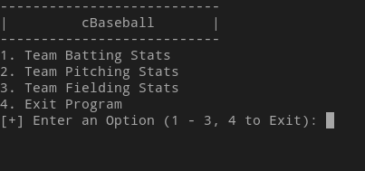
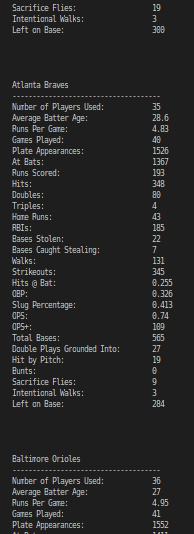
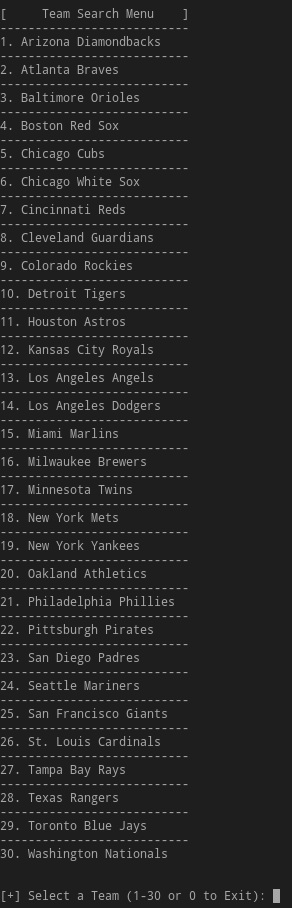
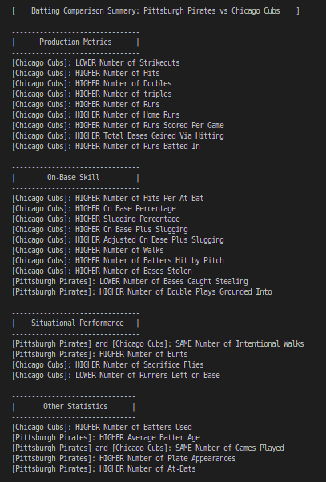

# cBaseball


## Description
Using statsitics sourced from [baseball-reference.com](https://www.baseball-reference.com) and provided in CSV format, cBaseball is a command-line tool that allows the user to conveniently view team-level baseball statistics. In addition to displaying these statistics in an easily-understood format, cBaseball also facilitates team comparison, generating a comparison summary across three categories: hitting, fielding, and pitching.

## Installation

#### Prerequisites
**Linux**: Ensure you have g++ and git installed.
**Windows**: Ensure you have MinGW and git installed.


### Linux Installation (Tested on Ubuntu / Fedora)

#### 1. Install Git and g++
```bash
sudo apt update
sudo apt install git g++
```

#### 2. Clone the Repository & Compile
```bash
git clone https://github.com/AB1775/cBaseball
cd cBaseball/
g++ -o cBaseball cBaseball.cpp
```
#### 3. Run the Program
```bash
./cBaseball
```
### Windows Installation (Tested on Windows 10 Home)

#### 1. Install MinGW
1. Download MinGW Installer from MinGW-w64.org
2. Select 'gcc' for Installation
3. Add MinGW to your PATH Environment Variable

#### 2. Install git
1. Download Git for Windows from git-scm.com
2. Follow the installation instructions

#### 3. Clone the Repostory & Compile
```cmd
git clone https://github.com/AB1775/cBaseball
cd cBaseball/
g++ -o cBaseball.exe cBaseball.cpp
```

#### 4. Run the Program
```cmd
.\cBaseball.exe
```
## Usage
After compiling and running the executable, you will be presented with a menu-driven interface. Follow the on-screen prompts to navigate through the program.



#### Selecting a Category
Select a category from the 3 menu items displayed by entering the appropriate number associated with the category.

#### Viewing Team Statistics
After selecting the desired category, you will be able to display league-wide stats, search for a specific team, or compare two teams. The "Display all <category> Stats" option outputs the stats of all 30 MLB teams for the specified category in alphabetical order.



The "Search Team" option allows you to output the statistics of an individual team, presenting the user with a numbered list of all 30 MLB teams.



#### Comparing Team Statistics
Similar to the "Search Team" menu, the "Compare Team Statistics" option presents the user with a numbered list of all 30 MLB teams. Rather than selecting a single team, the user will be prompted to select two teams. From here, the statistics of both teams will be displayed along with a comparison summary. An example of this summary is shown below:



#### Updating Statistics Files
**[IMPORTANT]** This program uses the **Team Standard Batting**, **Team Standard Pitching**, and **Team Fielding** files.

1. Open [https://www.baseball-reference.com/leagues/majors/2024.shtml](https://www.baseball-reference.com/leagues/majors/2024.shtml)
2. Locate the "Team Standard Batting" header
3. Hover over the "Share & Export" drop-down menu below the title header
4. Select "Get Table as CSV (for Excel)
5. Copy the contents of this file, beginning with the header line (Tm,#Bat,BatAge, etc.) and paste it in the "team_standard_batting24.csv" file, ensuring that the file's previous contents are replaced with the new data.

**Follow this process to update "Team Standard Pitching" and "Team Fielding"**

#### Changing File Names and File Paths
If you want to store the CSV files in a different directory or change the names of the CSV files, you need to update the file paths in the source code before compiling:

1. Open FileHandling.h.
2. Locate the variables that define the file paths for the statistics files under "File Variables."
3. Update these paths to point to the new directory where your CSV files are stored and/or update the file names.
4. Recompile the program to apply the changes.

## Acknowledgements
- Data files provided by [baseball-reference.com](https://www.baseball-reference.com), provider of complete current and historical baseball stats
- Special thanks to the creators of the libraries and tools used in this project
